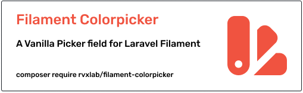

# Gegroet!

I'm RVxLab, a full-stack developer from the Netherlands 🇳🇱

## Some of my projects

## Some stats

  
Show me!

  
   
  
  
  
  

[laravel]: https://img.shields.io/badge/laravel-%23FF2D20.svg?style=for-the-badge&logo=laravel&logoColor=white
[php]: https://img.shields.io/badge/php-%23777BB4.svg?style=for-the-badge&logo=php&logoColor=white
[js]: https://img.shields.io/badge/javascript-%23323330.svg?style=for-the-badge&logo=javascript&logoColor=%23F7DF1E"
